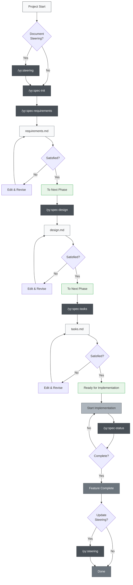
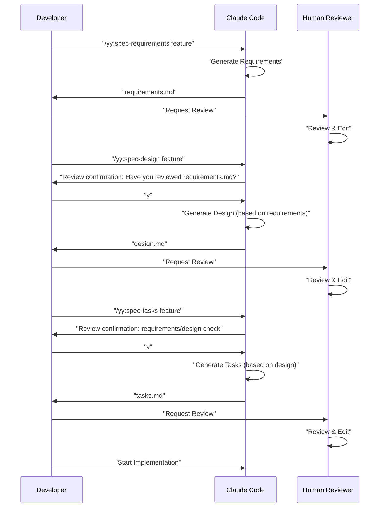

# Multi-Platform Spec-Driven Development

> ⚠️ **Legacy documentation (archived).** This page reflects an early yy-spec workflow and is kept for reference only. For the latest instructions, see the [current README](../../README.md).

> 🌐 **Language**  
> 📖 **English Version** (This page) | 📖 **[日本語版 README](README.md)** | 📖 **[繁體中文說明](README_zh-TW.md)**

> 🚀 **Supported Platforms**  
> 🤖 **Claude Code** | 🔮 **Cursor** | ⚡ **Gemini CLI** | 🧠 **Codex CLI**

> [!Warning]
> This is an initial version and will be improved as we use it

A comprehensive Spec-Driven Development toolset supporting Claude Code, Cursor, Gemini CLI, and Codex CLI platforms. This project replicates Kiro IDE's specification-driven development workflow across multiple AI development platforms.

**High Kiro IDE Compatibility** — Leverage existing Kiro SDD specifications, workflows, and directory structures seamlessly.

## Overview

This project provides a toolset for efficient Spec-Driven Development using Slash Commands across multiple AI platforms (Claude Code, Cursor, Gemini CLI, Codex CLI, GitHub Copilot, Qwen Code, Windsurf). By using appropriate commands for each development phase, you can achieve a systematic and high-quality development process regardless of your preferred platform.

## Setup

### Integrating into Your Own Project

Copy the appropriate directory based on your AI development platform:

#### Platform-Specific Directories
- **🤖 Claude Code**: `.claude/commands/` - Slash Commands definitions
- **🧠 Codex CLI**: `.codex/prompts/` - OpenAI Codex prompt definitions
- **🔮 Cursor**: `.cursor/commands/` - Cursor command definitions  
- **⚡ Gemini CLI**: `.gemini/commands/` - TOML configuration files
- **🐙 GitHub Copilot**: `.github/prompts/` - Prompt collections for Copilot Chat
- **🔧 Qwen Code**: `.qwen/commands/yy/` - Qwen Code slash commands
- **🌊 Windsurf IDE**: `.windsurf/workflows/` - Windsurf workflow definitions

#### Common Configuration Files
- **Configuration files**: Copy platform-specific config files (`CLAUDE.md`, `AGENTS.md`, etc.) as needed


### Initial Setup Steps

1. **Platform Selection**: Copy the directory corresponding to your AI development environment
2. **Configuration Adjustment**: Adjust platform-specific configuration files for your project
3. **Run initial commands** (common across platforms):
   ```bash
   # Optional: Create steering documents
   /yy:steering
   
   # Create your first feature specification
   /yy:spec-init "Detailed description of your project"
   ```

### Required Directory Structure

When you run commands, the following directories will be automatically created:

```
your-project/
├── .claude/commands/yy/     # Claude Code slash command definitions
├── .codex/prompts/            # Codex CLI prompt definitions
├── .cursor/commands/yy/     # Cursor command definitions
├── .gemini/commands/yy/     # Gemini CLI TOML definitions
├── .github/prompts/           # GitHub Copilot prompt collections
├── .qwen/commands/yy/       # Qwen Code slash command definitions
├── .windsurf/workflows/       # Windsurf workflow files
├── .yy-dev/
│   ├── steering/              # Auto-generated steering documents
│   └── specs/                 # Auto-generated feature specifications  
├── CLAUDE.md                  # Copied and renamed from language-specific quickstart
└── (your project files)
```

## Usage

### 1. For New Projects

```bash
# Optional: Generate project steering (recommended but not required)
/yy:steering

# Step 1: Start creating new feature specification (include detailed description)
/yy:spec-init "I want to create a feature where users can upload PDFs, extract diagrams and charts from them, and have AI explain the content. Tech stack: Next.js, TypeScript, Tailwind CSS."

# Step 2: Requirements definition (use auto-generated feature-name)
/yy:spec-requirements pdf-diagram-extractor
# → Review and edit .yy-dev/specs/pdf-diagram-extractor/requirements.md

# Step 3: Technical design (interactive approval)
/yy:spec-design pdf-diagram-extractor
# → Respond to "Have you reviewed requirements.md? [y/N]"
# → Review and edit .yy-dev/specs/pdf-diagram-extractor/design.md

# Step 4: Task generation (interactive approval)
/yy:spec-tasks pdf-diagram-extractor
# → Respond to review confirmation for requirements and design
# → Review and edit .yy-dev/specs/pdf-diagram-extractor/tasks.md

# Step 5: Start implementation
```

### 2. Adding Features to Existing Projects

```bash
# Optional: Create or update steering
# Same command handles both new creation and updates
/yy:steering

# Step 1: Start creating new feature specification
/yy:spec-init "Detailed description of the new feature here"
# Following steps are the same as for new projects
```

### 3. Progress Tracking

```bash
# Check progress of a specific feature
/yy:spec-status my-feature

# Displays current phase, approval status, and task progress
```

## Spec-Driven Development Process

### Process Flow Diagram

In this flow, each phase requires "Review & Approval".

**Steering documents** are documents that record persistent knowledge about the project (architecture, tech stack, code conventions, etc.). Creating and updating them is optional but recommended for long-term maintainability of the project.



## Slash Commands Reference

### 🚀 Phase 0: Project Steering (Optional)

| Command | Purpose | When to Use |
|---------|---------|-------------|
| `/yy:steering` | Smart creation or update of steering documents | All scenarios (both new and updates) |
| `/yy:steering-custom` | Create custom steering documents | When special conventions or guidelines are needed |

**Note**: Steering documents are recommended but not required. They can be omitted for small feature additions or experimental development.

#### Types of Steering Documents
- **product.md**: Product overview, features, use cases
- **tech.md**: Architecture, tech stack, development environment
- **structure.md**: Directory structure, code conventions, naming rules
- **Custom documents**: API conventions, testing policies, security policies, etc.

### 📋 Phase 1: Specification Creation

| Command | Purpose | When to Use |
|---------|---------|-------------|
| `/yy:spec-init [detailed project description]` | Initialize specification structure from project description | When starting new feature development |
| `/yy:spec-requirements [feature-name]` | Generate requirements document | Immediately after spec initialization |
| `/yy:spec-design [feature-name]` | Generate technical design document | After requirements approval |
| `/yy:spec-tasks [feature-name]` | Generate implementation tasks | After design approval |

### 📊 Phase 2: Progress Management

| Command | Purpose | When to Use |
|---------|---------|-------------|
| `/yy:spec-status [feature-name]` | Check current progress and phase | Regularly during development |

## 3-Phase Approval Workflow

The core of this system requires human review and approval at each phase:



## Best Practices

### ✅ Recommendations

1. **Always start with steering**
   - Use `/yy:steering` for all scenarios (intelligently handles both creation and updates)
   - The unified command protects existing files while handling them appropriately

2. **Don't skip phases**
   - Strictly follow the order: Requirements → Design → Tasks
   - Ensure human review at each phase

3. **Regular progress checks**
   - Use `/yy:spec-status` to understand current situation
   - Update task completion status appropriately

4. **Maintain steering**
   - Run `/yy:steering` after major changes (automatically determines update strategy)
   - Update as the project grows

### ❌ Things to Avoid

1. **Moving to next phase without approval**
   - Don't forget to respond to confirmation prompts

2. **Neglecting steering documents**
   - Outdated information hinders development

3. **Not updating task status**
   - Progress becomes unclear and management becomes difficult

## Project Structure

```
.
├── .claude/
│   └── commands/          # Slash command definitions
│       └── kiro/
│           ├── spec-init.md
│           ├── spec-requirements.md
│           ├── spec-design.md
│           ├── spec-tasks.md
│           ├── spec-status.md
│           ├── steering.md          # Unified steering command
│           └── steering-custom.md
├── .yy-dev/
│   ├── steering/          # Steering documents
│   │   ├── product.md
│   │   ├── tech.md
│   │   └── structure.md
│   └── specs/             # Feature specifications
│       └── [feature-name]/
│           ├── spec.json      # Phase approval status
│           ├── requirements.md # Requirements document
│           ├── design.md      # Technical design document
│           └── tasks.md       # Implementation tasks
├── CLAUDE.md              # Main config (copied from a language-specific file below)
├── CLAUDE_en.md           # English version config
├── CLAUDE_zh-TW.md        # Traditional Chinese version config
├── README.md              # Japanese version README
├── README_en.md           # English version README
├── README_zh-TW.md        # Traditional Chinese version README
└── (your project files)
```

## Automation Features

The following are automated through Claude Code's hook functionality:

- Automatic task progress tracking
- Specification compliance checking
- Context preservation during compaction
- Steering drift detection

## Troubleshooting

### When commands don't work
1. Check existence of `.claude/commands/` directory
2. Verify command file naming convention (`command-name.md`)
3. Ensure you're using the latest version of Claude Code

### When stuck in approval flow
1. Check that you're responding correctly to review confirmation prompts
2. Verify previous phase approval is complete
3. Use `/yy:spec-status` to diagnose current state
4. Manually check/edit `spec.json` if needed

## Summary

Claude Code's Slash Commands enable Spec-Driven Development that achieves:

- 📐 Systematic development process
- ✅ Quality assurance through phased approval
- 📊 Transparent progress management
- 🔄 Continuous documentation updates
- 🤖 AI-assisted efficiency

Using this system can significantly improve development quality and efficiency.
