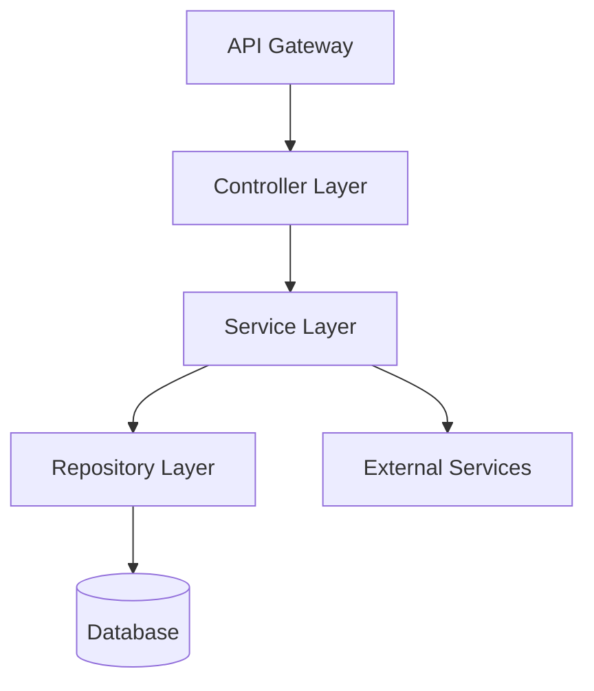

# 自定义指南

> 📖 **简体中文指南（本页）** | [English](../customization-guide.md)

本指南说明如何编辑 cc-sdd 的模板和规则，以适应团队特定的工作流。

## 简介

cc-sdd 提供两个自定义点：

- **templates/** - 定义 AI 生成文档的**结构和格式**
- **rules/** - 定义 AI 的**判断标准和生成原则**

两者都位于 `{{KIRO_DIR}}/settings/` 下，并在整个项目中共享。

---

## 两种自定义方式

### 📄 templates/ - 自定义输出格式

**位置**：`{{KIRO_DIR}}/settings/templates/specs/`

**作用**：定义 AI 生成的**文档结构**。模板中添加的章节和字段将由 AI 自动填充。

**需要编辑的文件**：
- `requirements.md` - 需求文档结构
- `design.md` - 设计文档结构
- `tasks.md` - 任务拆解结构

**自定义示例**：
- 添加 PRD 风格章节（产品概述、成功指标等）
- 添加审批清单
- 添加 JIRA 字段

---

### 📋 rules/ - 自定义 AI 判断标准

**位置**：`{{KIRO_DIR}}/settings/rules/`

**作用**：定义 AI 的**生成规则和原则**。编辑规则会改变 AI 的判断标准和生成风格。

**需要编辑的文件**：
- `ears-format.md` - EARS 格式需求描述规则
- `design-principles.md` - 设计原则和文档标准
- `tasks-generation.md` - 任务拆解粒度和结构规则
- `tasks-parallel-analysis.md` - 判断并行可执行性的标准
- 其他（`design-discovery-*.md`、`gap-analysis.md` 等）

**自定义示例**：
- 调整任务粒度（1-3 小时 → 4-8 小时等）
- 添加设计原则（安全性、性能要求等）
- 需求优先级判断标准

---

## 🚨 必须维护的结构

cc-sdd 命令通过 AI Agent 读取和理解文档。以下元素**必须维护**：

| 文件 | 必需元素 | 原因 |
|------|---------|------|
| **requirements.md** | 编号标准（`1.`、`2.`、`3.`...） | AI 识别标准的编号和结构 |
| | 与模板的一致性 | AI 从模板学习结构 |
| **design.md** | **文件存在** | 命令读取此文件 |
| **tasks.md** | `- [ ] N.` 复选框格式 | 任务执行引擎识别此格式 |
| | `_Requirements: X, Y_` 引用 | 需求可追溯性 |
| | 层次结构（1、1.1、1.2...） | 依赖分析 |

**重要**：requirements.md 中的标题可以自由更改。AI 从模板学习结构模式，并使用相同模式生成。

### ✅ requirements.md 的灵活性（重要）

requirements.md 非常灵活，可以自定义：

#### 1. 标题名称自定义

**标题名称可以自由更改**。AI 从模板学习结构：

- ✅ **英文**：`### Requirement 1:` / `#### Acceptance Criteria`
- ✅ **本地化**：`### 需求 1:` / `#### 验收标准`（支持任何语言）
- ✅ **自定义**：`### REQ-1:` / `#### 验证标准`

**关键点**：
- 维护编号模式（`N:`，其中 N 是数字）
- 维护层次结构（`###` 和 `####`）
- 保持模板与生成文件之间的一致性

#### 2. 验收标准描述格式

**推荐但非强制使用 EARS 格式**：

- ✅ **推荐 EARS 格式**：`WHEN [event] THEN [system] SHALL [action]` - AI 生成的默认格式
- ✅ **其他格式也可接受**：
  - 简单格式：`系统响应 XX`
  - BDD 格式：`GIVEN [context] WHEN [event] THEN [outcome]`
  - 自定义格式：团队自己的模板
- ✅ **编号很重要**：只要维护 `1.`、`2.`、`3.` 的格式，内容可以自由

**EARS 格式的优势**：
- 高可测试性（明确的条件和预期结果）
- 易于 AI 理解（提高设计/任务生成的准确性）
- 行业标准（审查者易于阅读）

**只有结构是必须的**：AI 学习结构模式，不解析特定字符串。

### 🎯 requirements.md 自定义示例

#### 示例 1：本地化标题 + EARS 格式

```markdown
### 需求 1：用户认证

#### 验收标准
1. WHEN 用户点击登录按钮 THEN 系统显示认证界面
2. IF 输入无效凭据 THEN 系统显示错误信息
3. WHILE 认证进行中 THEN 系统显示加载指示器
```

**模板设置**：
```markdown
# templates/specs/requirements.md
### 需求 1：{{REQUIREMENT_AREA_1}}
#### 验收标准
```

**注意**：标题可以使用任何语言（英文、中文等），因为 AI 从模板学习结构模式。

#### 示例 2：英文标题 + BDD 格式

```markdown
### Requirement 1: User Authentication

#### Acceptance Criteria
1. GIVEN user is on login page WHEN clicks login button THEN authentication screen is displayed
2. GIVEN invalid credentials WHEN attempting login THEN error message is displayed
3. GIVEN authentication in progress WHEN displaying screen THEN loading indicator is displayed
```

#### 示例 3：自定义 ID + 简单格式

```markdown
### REQ-001: 用户认证

#### 验证标准
1. 当用户点击登录按钮时，系统显示认证界面
2. 当输入无效凭据时，系统显示错误信息
3. 认证处理过程中，系统显示加载指示器
```

**模板设置**：
```markdown
# templates/specs/requirements.md
### REQ-001: {{REQUIREMENT_AREA_1}}
#### 验证标准
```

#### 示例 4：默认（英文标题 + EARS 格式）

```markdown
### Requirement 1: User Authentication

#### Acceptance Criteria
1. WHEN user clicks login button THEN system displays authentication screen
2. IF invalid credentials are entered THEN system displays error message
3. WHILE authentication is in progress THEN system displays loading indicator
```

**✅ 所有这些格式都是有效的。** 标题名称和 ID 格式在模板中定义，描述格式（EARS/BDD/简单）在规则中调整。

### ✅ design.md 的灵活性（重要）

**design.md 几乎没有内容约束**。您可以自由自定义以匹配团队的审查流程和分析工具：

- ✅ **标题名称自由**：`## Architecture`、`## System Design`、`## Technical Design` 等可以更改为任何语言或风格
- ✅ **标题顺序也自由**：将需求可追溯性放在顶部，将数据模型放在架构附近等
- ✅ **添加/删除章节**：添加团队特定的审查项，删除不必要的章节
- ✅ **格式变更**：表格、列表、图表等可以自由选择

**关于 Mermaid 图表**：基本语法规则在 `{{KIRO_DIR}}/settings/rules/design-principles.md` 中定义，不在模板约束中。可以通过编辑规则文件来更改图表要求。

**只有文件存在是必须的**：命令读取 `design.md`，但不解析特定标题或格式。

### 🎯 design.md 自定义示例

#### 示例 1：与内部审查流程对齐

```markdown
## 1. 概述（必填）
## 2. 业务需求一致性（必填）
## 3. 安全审查（必填）
## 4. 架构设计（必填）
## 5. 性能验证（仅 P0 功能）
## 6. 审批
```

#### 示例 2：分析工具集成

```markdown
## Design-ID: FEAT-2024-001
## Trace-Matrix
| Req ID | Design Element | Test ID | Implementation File |
|--------|----------------|---------|-------------------|
| REQ-1 | Component A | TEST-1 | src/a.ts |

## Architecture
...
```

#### 示例 3：本地化标题

```markdown
## 概述
## 系统架构
## 模块设计
## 数据结构
## 错误处理
## 测试策略
```

**注意**：标题可以使用任何语言。重要的是结构，而非特定措辞。

**✅ 所有这些自定义都是有效的。** 命令不受影响。

---

## 自定义步骤（3 步）

### 步骤 1：检查默认模板

```bash
# 检查模板位置
ls -la {{KIRO_DIR}}/settings/templates/specs/
ls -la {{KIRO_DIR}}/settings/rules/
```

### 步骤 2：在维护结构的同时添加/编辑

- **templates/**：添加章节和字段
- **rules/**：添加原则和标准

### 步骤 3：通过测试执行进行验证

```bash
# 使用新规格测试
/yy:spec-init Test customization feature
/yy:spec-requirements test-customization
/yy:spec-design test-customization
/yy:spec-tasks test-customization

# 检查生成的文件
cat {{KIRO_DIR}}/specs/test-customization/requirements.md
cat {{KIRO_DIR}}/specs/test-customization/design.md
cat {{KIRO_DIR}}/specs/test-customization/tasks.md
```

---

## 实践场景

我们介绍 3 个针对团队特定需求量身定制的代表性自定义场景。每个场景都包含完整的可复制代码和测试方法。

---

## 场景 1：PRD 风格需求

### 📋 自定义目标

- **templates**：`{{KIRO_DIR}}/settings/templates/specs/requirements.md`
- **rules**：`{{KIRO_DIR}}/settings/rules/ears-format.md`（可选）

### 🎯 使用场景

- 产品/业务团队作为利益相关者参与
- 需求审查中必须包含业务上下文、优先级和成功指标
- 有许多非工程师审查者

### 🔧 自定义步骤

#### 步骤 1：模板编辑（必填）

**需要编辑的文件**：`{{KIRO_DIR}}/settings/templates/specs/requirements.md`

**🔒 需要维护的结构**：
- 编号标题模式（例如 `### Requirement N:`、`### REQ-N:` 或本地化等价物）
- 标准章节标题（例如 `#### Acceptance Criteria` 或本地化等价物）
- 编号标准（`1.`、`2.`、`3.`...）

**💡 标题名称自由**：如果在模板中定义，AI 会使用相同模式生成。
**💡 建议**：使用 EARS 格式（`WHEN ... THEN ...`）提高 AI 生成准确性，但其他格式也可使用。

**➕ 要添加的完整模板**：

<details>
<summary><strong>可复制的完整模板</strong></summary>

```markdown
# Requirements Document

## Product Context

**Problem Statement**: {{PROBLEM_DESCRIPTION}}

**Target Users**: {{TARGET_USERS}}

**Success Metrics**: {{SUCCESS_METRICS}}

**Timeline**: {{TIMELINE}}

**Business Impact**: {{BUSINESS_IMPACT}}

---

## Requirements

### Requirement 1: {{REQUIREMENT_AREA_1}}

**Objective**: As a {{ROLE}}, I want {{CAPABILITY}}, so that {{BENEFIT}}

**Business Priority**: P0 (Critical) / P1 (High) / P2 (Medium)

**Dependencies**: {{DEPENDENCIES}}

**Risk Level**: Low / Medium / High

#### Acceptance Criteria

1. WHEN {{EVENT}} THEN the {{SYSTEM}} SHALL {{RESPONSE}}
2. IF {{CONDITION}} THEN the {{SYSTEM}} SHALL {{RESPONSE}}
3. WHERE {{FEATURE_INCLUDED}} THE {{SYSTEM}} SHALL {{RESPONSE}}

**Verification Method**: {{TEST_TYPE}}

**Success Threshold**: {{THRESHOLD}}

---

### Requirement 2: {{REQUIREMENT_AREA_2}}

**Objective**: As a {{ROLE}}, I want {{CAPABILITY}}, so that {{BENEFIT}}

**Business Priority**: P0 / P1 / P2

**Dependencies**: {{DEPENDENCIES}}

**Risk Level**: Low / Medium / High

#### Acceptance Criteria

1. WHEN {{EVENT}} THEN the {{SYSTEM}} SHALL {{RESPONSE}}
2. WHEN {{EVENT}} AND {{CONDITION}} THEN the {{SYSTEM}} SHALL {{RESPONSE}}

**Verification Method**: {{TEST_TYPE}}

**Success Threshold**: {{THRESHOLD}}

<!-- Additional requirements continue with same pattern -->

---

## Non-Functional Requirements

### Requirement NFR-1: Performance

**Objective**: System responsiveness and scalability

#### Acceptance Criteria

1. WHEN page loads THEN system SHALL respond within 2 seconds
2. WHEN API called THEN system SHALL respond within 200ms
3. WHEN {{CONCURRENT_USERS}} users access THEN system SHALL maintain response time

**Verification Method**: Load testing

**Success Threshold**: 95th percentile < 200ms

---

### Requirement NFR-2: Security

**Objective**: Data protection and access control

#### Acceptance Criteria

1. WHEN user authenticates THEN system SHALL enforce MFA
2. WHEN data stored THEN system SHALL encrypt at rest
3. WHEN data transmitted THEN system SHALL use TLS 1.3

**Verification Method**: Security audit

**Success Threshold**: Zero critical vulnerabilities

---

## Compliance & Approvals

**Compliance Requirements**: {{COMPLIANCE_LIST}}

**Review Checklist**:
- [ ] Product team reviewed
- [ ] Business stakeholder approved
- [ ] Legal/Compliance reviewed
- [ ] Security team approved

**Approval History**:
- Product Owner: {{APPROVER_NAME}} - {{DATE}}
- Engineering Lead: {{APPROVER_NAME}} - {{DATE}}
```

</details>

#### 步骤 2：规则调整（可选——用于更严格的控制）

**需要编辑的文件**：`{{KIRO_DIR}}/settings/rules/ears-format.md`

**要添加的内容**：

<details>
<summary><strong>规则文件添加内容</strong></summary>

```markdown
## PRD-Specific Requirements

### Business Context Requirements

Every requirement MUST include:

- **Priority**: P0 (Critical) / P1 (High) / P2 (Medium)
  - P0: Blocking launch, must have
  - P1: Important for launch, strong preference
  - P2: Nice to have, can defer

- **Timeline**: Target delivery date or sprint number

- **Success Metrics**: Quantifiable measurement
  - User engagement metrics
  - Performance benchmarks
  - Business KPIs

### Verification Standards

Each acceptance criterion MUST specify:

- **Verification Method**:
  - Unit test
  - Integration test
  - Manual QA
  - Acceptance test
  - Performance test
  - Security audit

- **Success Threshold**: Specific measurable value
  - Examples: "< 200ms", "> 95% uptime", "Zero critical bugs"

### Non-Functional Requirements

Always include NFR sections for:
- Performance (response time, throughput)
- Security (authentication, encryption, access control)
- Scalability (concurrent users, data volume)
- Reliability (uptime, error rates)
- Usability (accessibility, UX metrics)
```

</details>

### ✅ 完成后的行为

当您运行 `/yy:spec-requirements my-feature` 时：

1. **Product Context** 章节自动生成
2. 每个需求包含 **Business Priority**、**Dependencies**、**Risk Level**
3. 每个需求添加 **Verification Method** 和 **Success Threshold**
4. **Non-Functional Requirements** 章节自动生成
5. 添加 **Compliance & Approvals** 清单
6. 需求编号和验收标准结构得到维护（与 `/yy:spec-impl` 兼容）

### 🧪 测试方法

```bash
# 1. 编辑模板
vim {{KIRO_DIR}}/settings/templates/specs/requirements.md

# 2. （可选）编辑规则
vim {{KIRO_DIR}}/settings/rules/ears-format.md

# 3. 使用新规格验证
/yy:spec-init Test PRD-style requirements with business context
/yy:spec-requirements test-prd-feature

# 4. 检查生成的 requirements.md
cat {{KIRO_DIR}}/specs/test-prd-feature/requirements.md

# 5. 验证 Product Context、Priority、NFR 章节已包含
grep -A 5 "## Product Context" {{KIRO_DIR}}/specs/test-prd-feature/requirements.md
grep "Business Priority" {{KIRO_DIR}}/specs/test-prd-feature/requirements.md
grep -A 3 "## Non-Functional Requirements" {{KIRO_DIR}}/specs/test-prd-feature/requirements.md
```

---

## 场景 2：后端/API 专注的设计文档

### 📋 自定义目标

- **templates**：`{{KIRO_DIR}}/settings/templates/specs/design.md`
- **rules**：`{{KIRO_DIR}}/settings/rules/design-principles.md`（可选）

### 🎯 使用场景

- REST/GraphQL API 开发
- 微服务架构
- 数据库设计和 schema 定义很重要

### 🔧 自定义步骤

#### 步骤 1：模板编辑（必填）

**需要编辑的文件**：`{{KIRO_DIR}}/settings/templates/specs/design.md`

**🔒 需要维护的结构**：
- **只需文件存在** - 标题名称、顺序和格式均自由

**➕ 要添加的章节**：

<details>
<summary><strong>后端专注模板（附加部分）</strong></summary>

在现有 `design.md` 中添加以下章节：

```markdown
## API Specification

### Base Configuration

**Base URL**: `{{BASE_URL}}`

**API Version**: `v{{VERSION}}`

**Authentication**: Bearer token (JWT) / API Key / OAuth 2.0

**Rate Limiting**: {{RATE_LIMIT}} requests per {{TIME_WINDOW}}

---

### Endpoints

#### POST /api/v1/{{resource}}

**Description**: {{ENDPOINT_DESCRIPTION}}

**Authentication**: Required

**Request Headers**:
```http
Authorization: Bearer {{token}}
Content-Type: application/json
```

**Request Body**:
```json
{
  "field1": "string",
  "field2": 123,
  "field3": {
    "nestedField": "value"
  }
}
```

**Request Validation**:
- `field1`: Required, string, max 255 characters
- `field2`: Required, integer, range 1-1000
- `field3.nestedField`: Optional, string

**Response (200 OK)**:
```json
{
  "data": {
    "id": "uuid",
    "field1": "string",
    "field2": 123,
    "createdAt": "ISO 8601 timestamp"
  },
  "meta": {
    "timestamp": "ISO 8601",
    "requestId": "uuid"
  }
}
```

**Error Responses**:

- **400 Bad Request**:
```json
{
  "error": {
    "code": "INVALID_INPUT",
    "message": "Validation failed",
    "details": {
      "field1": ["Required field missing"]
    }
  }
}
```

- **401 Unauthorized**:
```json
{
  "error": {
    "code": "UNAUTHORIZED",
    "message": "Invalid or expired token"
  }
}
```

---

## Database Schema

### Tables

#### {{table_name}}

**Schema**:
```sql
CREATE TABLE {{table_name}} (
  id UUID PRIMARY KEY DEFAULT gen_random_uuid(),
  field1 VARCHAR(255) NOT NULL,
  field2 INTEGER NOT NULL CHECK (field2 >= 0),
  field3 JSONB,
  status VARCHAR(50) NOT NULL DEFAULT 'active',
  created_at TIMESTAMP WITH TIME ZONE NOT NULL DEFAULT NOW(),
  updated_at TIMESTAMP WITH TIME ZONE NOT NULL DEFAULT NOW(),
  deleted_at TIMESTAMP WITH TIME ZONE,

  CONSTRAINT {{constraint_name}} UNIQUE (field1)
);
```

**Indexes**:
```sql
CREATE INDEX idx_{{table_name}}_field1 ON {{table_name}} (field1);
CREATE INDEX idx_{{table_name}}_status ON {{table_name}} (status) WHERE deleted_at IS NULL;
CREATE INDEX idx_{{table_name}}_created_at ON {{table_name}} (created_at DESC);
```

---

### Relationships

```mermaid
erDiagram
    {{TABLE1}} ||--o{ {{TABLE2}} : "has many"
    {{TABLE2}} }o--|| {{TABLE3}} : "belongs to"
```

---

## Service Architecture

### Service Layers



**Layer Responsibilities**:
- **Controller**: Request validation, response formatting
- **Service**: Business logic, transaction management
- **Repository**: Data access, query building
- **External Services**: Third-party API integration

---

## Security

### Authentication & Authorization

**Authentication Method**: JWT / OAuth 2.0 / API Key

**Authorization Model**: RBAC / ABAC

**Protected Resources**:
- {{RESOURCE_1}}: Requires {{PERMISSION}}
- {{RESOURCE_2}}: Requires {{PERMISSION}}
```

</details>

#### 步骤 2：规则调整（可选）

**需要编辑的文件**：`{{KIRO_DIR}}/settings/rules/design-principles.md`

**要添加的内容**：

<details>
<summary><strong>后端设计原则补充</strong></summary>

```markdown
## Backend-Specific Design Principles

### API Design Principles

1. **RESTful Resource Modeling**
   - Resources are nouns, not verbs
   - Use HTTP methods correctly (GET, POST, PUT, DELETE)
   - Stateless operations

2. **API Versioning**
   - URL-based versioning: `/api/v1/resource`
   - Maintain backward compatibility within version
   - Deprecation timeline: Minimum 6 months notice

3. **Idempotency**
   - POST: Not idempotent
   - PUT, DELETE, GET: Idempotent
   - Use idempotency keys for critical operations

4. **Error Response Consistency**
   - Structured error format across all endpoints
   - Include error code, message, and optional details
   - Use appropriate HTTP status codes

### Database Design Principles

1. **Normalization**
   - Start with 3NF (Third Normal Form)
   - Denormalize only for proven performance needs
   - Document denormalization decisions

2. **Index Strategy**
   - Index foreign keys
   - Index frequently queried columns
   - Monitor and optimize query performance

3. **Data Integrity**
   - Use database constraints (NOT NULL, UNIQUE, CHECK)
   - Foreign key constraints with appropriate CASCADE rules
   - Validate at both application and database levels

4. **Migration Safety**
   - All schema changes must be reversible
   - Test migrations on production-like data
   - Zero-downtime migration strategy for production

### Service Architecture Principles

1. **Separation of Concerns**
   - Controller: HTTP layer only
   - Service: Business logic
   - Repository: Data access
   - No cross-layer dependencies

2. **Dependency Direction**
   - Always depend on abstractions (interfaces)
   - Outer layers depend on inner layers
   - No circular dependencies

3. **Transaction Management**
   - Keep transactions short
   - Handle transaction boundaries in service layer
   - Use optimistic locking for concurrent updates

### Security Principles

1. **Defense in Depth**
   - Multiple layers of security
   - Validate at every layer (client, API, service, database)
   - Fail securely (deny by default)

2. **Least Privilege**
   - Grant minimum necessary permissions
   - Use role-based access control
   - Regular permission audits
```

</details>

### ✅ 完成后的行为

当您运行 `/yy:spec-design my-backend-feature` 时：

1. **API Specification** 为所有端点生成详细规范
2. **Database Schema** 明确定义表、索引和约束
3. **Service Architecture** 可视化层结构和依赖关系
4. **Security** 章节定义认证、授权和加密策略
5. **Monitoring & Observability** 规划日志、指标和追踪
6. 生成面向后端/API 开发的设计文档

### 🧪 测试方法

```bash
# 1. 编辑模板
vim {{KIRO_DIR}}/settings/templates/specs/design.md

# 2. 使用新规格验证
/yy:spec-init Build RESTful API for user management
/yy:spec-requirements user-api
/yy:spec-design user-api

# 3. 检查生成的 design.md
cat {{KIRO_DIR}}/specs/user-api/design.md

# 4. 验证后端专注章节已包含
grep -A 20 "## API Specification" {{KIRO_DIR}}/specs/user-api/design.md
grep -A 15 "## Database Schema" {{KIRO_DIR}}/specs/user-api/design.md
grep -A 10 "## Security" {{KIRO_DIR}}/specs/user-api/design.md
```

---

## 场景 3：领域特定规则（Steering 自定义）

### 📋 自定义目标

- **创建**：使用 `/yy:steering-custom` 命令创建
- **保存到**：`{{KIRO_DIR}}/steering/{{domain-name}}.md`
- **规则调整**：`{{KIRO_DIR}}/settings/rules/steering-principles.md`（可选）

### 🎯 使用场景

- 统一整个项目中的 API 标准、认证方法、错误处理等领域特定规则
- 为新成员在入职期间参考的约定集
- 训练 AI 在所有规格生成中自动反映规则

### 🔧 自定义步骤

#### 步骤 1：创建 Steering 文档

**命令**：`/yy:steering-custom`

**提示示例**：
```
Create domain-specific steering for REST API standards:
- Versioning strategy
- Authentication methods
- Error response format
- Rate limiting
- Pagination
```

**生成文件**：`{{KIRO_DIR}}/steering/api-standards.md`

**完整模板示例**：

<details>
<summary><strong>完整 API 标准 Steering 示例</strong></summary>

```markdown
# API Standards

## Purpose

This steering document defines REST API standards for all backend services in this project. All API designs must follow these conventions to ensure consistency and interoperability.

---

## REST Conventions

### Base URL Structure

**Pattern**: `https://{{domain}}/api/{{version}}/{{resource}}`

**Examples**:
- `https://api.example.com/api/v1/users`
- `https://api.example.com/api/v1/orders/:id`

### Versioning Strategy

**Method**: URL-based versioning

**Version Format**: `/v1`, `/v2`, `/v3`

**Deprecation Policy**:
- New version announcement: Minimum 3 months notice
- Support period: 6 months after new version release
- Sunset timeline: Communicated via API response headers

---

### HTTP Methods

**Use Standard Semantics**:

| Method | Usage | Idempotent | Request Body | Response Body |
|--------|-------|-----------|--------------|---------------|
| GET | Retrieve resource(s) | Yes | No | Yes |
| POST | Create new resource | No | Yes | Yes |
| PUT | Update entire resource | Yes | Yes | Yes |
| PATCH | Partial update | No | Yes | Yes |
| DELETE | Remove resource | Yes | No | No (204) |

---

### Resource Naming

**Rules**:
- Use plural nouns: `/users`, `/orders`, `/products`
- Use kebab-case for multi-word resources: `/user-profiles`
- Avoid verbs in URLs: `/users/123` not `/getUser/123`
- Use sub-resources for relationships: `/users/123/orders`

---

## Authentication

### Methods

**Primary**: Bearer Token (JWT)

**Secondary**: API Key (for server-to-server)

**OAuth 2.0**: For third-party integrations

### JWT Token Structure

**Token Expiration**:
- Access Token: 15 minutes
- Refresh Token: 7 days

---

## Request/Response Format

### Success Response (200, 201):
```json
{
  "data": {
    "id": "uuid",
    "field1": "value",
    "createdAt": "2024-01-01T00:00:00Z"
  },
  "meta": {
    "timestamp": "2024-01-01T00:00:00Z",
    "requestId": "uuid"
  }
}
```

---

## Error Handling

### Error Response Structure

```json
{
  "error": {
    "code": "ERROR_CODE",
    "message": "Human-readable error message",
    "details": {
      "field": ["Validation error message"]
    },
    "traceId": "uuid"
  }
}
```

### HTTP Status Codes

**Success (2xx)**:
- `200 OK`: Request succeeded
- `201 Created`: Resource created
- `204 No Content`: Success with no response body

**Client Errors (4xx)**:
- `400 Bad Request`: Invalid request syntax or validation error
- `401 Unauthorized`: Missing or invalid authentication
- `403 Forbidden`: Authenticated but insufficient permissions
- `404 Not Found`: Resource doesn't exist
- `429 Too Many Requests`: Rate limit exceeded

**Server Errors (5xx)**:
- `500 Internal Server Error`: Unexpected server error
- `503 Service Unavailable`: Temporary unavailability

---

## Rate Limiting

### Rate Limit Policy

**Authenticated Users**:
- 1000 requests per hour
- 100 requests per minute

**Rate Limit Headers**:
```http
X-RateLimit-Limit: 1000
X-RateLimit-Remaining: 995
X-RateLimit-Reset: 1640000000
```

---

## Documentation

### OpenAPI/Swagger

**All APIs must**:
- Provide OpenAPI 3.0 spec
- Include examples for all endpoints
- Document all error codes
- Specify authentication requirements
```

</details>

#### 步骤 2：其他领域 Steering 示例

<details>
<summary><strong>认证标准</strong></summary>

`{{KIRO_DIR}}/steering/authentication.md`

```markdown
# Authentication Standards

## Password Policy

**Minimum Requirements**:
- Length: 12 characters
- Complexity: Upper, lower, number, special character
- History: Cannot reuse last 5 passwords
- Expiration: 90 days (for privileged accounts)

## Multi-Factor Authentication (MFA)

**Required For**:
- Admin accounts
- Production access
- Financial operations

**Supported Methods**:
- TOTP (Google Authenticator, Authy)
- SMS (fallback only)
- Hardware tokens (YubiKey)

## Session Management

**Session Timeout**:
- Inactive: 30 minutes
- Absolute: 12 hours

**Session Storage**: Redis with encryption

## JWT Best Practices

**Token Expiration**:
- Access: 15 minutes
- Refresh: 7 days

**Signing Algorithm**: RS256 (asymmetric)
```

</details>

<details>
<summary><strong>测试标准</strong></summary>

`{{KIRO_DIR}}/steering/testing.md`

```markdown
# Testing Standards

## Test Coverage Requirements

**Minimum Coverage**:
- Unit Tests: 80%
- Integration Tests: 60%
- E2E Tests: Critical paths only

## Unit Testing

**Framework**: Jest / Vitest / pytest

**Structure**:
```javascript
describe('ComponentName', () => {
  describe('methodName', () => {
    it('should return expected value when condition', () => {
      // Arrange
      // Act
      // Assert
    });
  });
});
```

## Integration Testing

**Scope**: Multiple components together

**Database**: Use test database or containers

## E2E Testing

**Framework**: Playwright / Cypress

**Critical Paths**:
- User registration and login
- Core business workflows
- Payment flows

## Continuous Integration

**CI Pipeline**:
1. Lint
2. Unit tests
3. Integration tests
4. E2E tests (on PR)
5. Build
6. Deploy to staging
```

</details>

<details>
<summary><strong>错误处理标准</strong></summary>

`{{KIRO_DIR}}/steering/error-handling.md`

```markdown
# Error Handling Standards

## Error Classification

### User Errors (4xx)
- Input validation failures
- Authentication failures
- Permission denials
- Resource not found

**Handling**: Return helpful error message

### System Errors (5xx)
- Database connection failures
- External service timeouts
- Unexpected exceptions

**Handling**: Log detailed error, return generic message to user

## Error Logging

**Log Levels**:
- DEBUG: Diagnostic information
- INFO: Normal operations
- WARN: Recoverable issues
- ERROR: Failures requiring attention
- FATAL: Critical failures

## Retry Logic

**Retry Policy**:
- Transient failures: Retry with exponential backoff
- Non-transient: Fail immediately

**Retryable Errors**:
- Network timeouts
- 5xx server errors
- Rate limit errors (429)

## Circuit Breaker

**Configuration**:
- Failure threshold: 50%
- Timeout: 30 seconds
- Reset timeout: 60 seconds
```

</details>

### ✅ 完成后的行为

创建 steering 文档后：

1. **所有规格生成命令**自动引用这些规则
2. `/yy:spec-design` 在 API 设计时自动应用标准格式
3. `/yy:spec-requirements` 自动包含错误处理需求
4. `/yy:spec-tasks` 按标准生成认证和测试相关任务

### 🧪 测试方法

```bash
# 1. 创建 steering 文档
/yy:steering-custom
# 提示：Create API standards steering document for REST conventions

# 2. 检查生成的文件
cat {{KIRO_DIR}}/steering/api-standards.md

# 3. 使用新规格验证 steering 应用
/yy:spec-init Build user management API
/yy:spec-design user-management-api

# 4. 检查生成的 design.md 中是否反映了 API 标准
grep -A 10 "## API Specification" {{KIRO_DIR}}/specs/user-management-api/design.md

# 5. 验证相同标准应用于其他功能
/yy:spec-init Build order processing API
/yy:spec-design order-processing-api
diff \
  <(grep "Error Response" {{KIRO_DIR}}/specs/user-management-api/design.md) \
  <(grep "Error Response" {{KIRO_DIR}}/specs/order-processing-api/design.md)
# 验证两个规格使用相同的错误格式
```

---

## 故障排查

### 自定义模板未反映

**检查项**：
- 文件路径：是否放置在 `{{KIRO_DIR}}/settings/templates/specs/` 中？
- 必需结构：编号模式是否维护（`### ... N:`、`1.`、`- [ ] N.`）？
- Markdown 语法：标题级别和代码块是否正确？

**解决方案**：恢复默认值并逐步重新自定义
```bash
npx cc-sdd@latest --overwrite=force
```

### 生成内容与预期不符

**原因**：混淆了 `templates/`（输出结构）和 `rules/`（AI 判断标准）的作用

**解决方案**：
- 模板：定义章节结构和格式
- 规则：包含含有 3+ 具体示例的强表达，如 "MUST"、"NEVER"

### 需求编号不一致

**原因**：模板中的标题模式与现有文件不匹配

**解决方案**：统一模板中定义的模式（例如 `### Requirement N:`）并应用于所有现有文件

### 团队间模板不同

**解决方案**：用 git 管理 `{{KIRO_DIR}}/settings/`
```bash
git add {{KIRO_DIR}}/settings/
git commit -m "Add team-wide templates"
```

---

## 最佳实践

### ✅ 推荐

- **逐步自定义**：每次更改并测试一个文件
- **维护必需结构**：保持编号模式和层次结构
- **版本控制**：用 git 管理 `{{KIRO_DIR}}/settings/`
- **强规则**："MUST" + 3+ 具体示例

### ❌ 不推荐

- 删除必需结构（编号、复选框）
- 模糊规则（"should"、"consider"）
- 超过 1000 行的模板
- 未经测试就提交

---

## 下一步

### 1. 确定自定义优先级

**推荐顺序**：
1. **requirements.md** - 一切基础的需求定义
2. **design.md** - 审查频率高的设计文档
3. **tasks.md** - 实施阶段使用最多
4. **steering/** - 领域知识的积累

### 2. 试点运行

```bash
# 1. 用小功能尝试
/yy:spec-init Small feature for testing custom templates
/yy:spec-requirements test-feature
/yy:spec-design test-feature
/yy:spec-tasks test-feature

# 2. 团队审查
# - 检查输出质量
# - 识别缺失信息
# - 调整模板

# 3. 开始生产运行
# - 通知整个团队
# - 更新入职材料
```

---

## 相关文档

- [规格驱动开发工作流](spec-driven.md)
- [命令参考](command-reference.md)
- [迁移指南](migration-guide.md)
